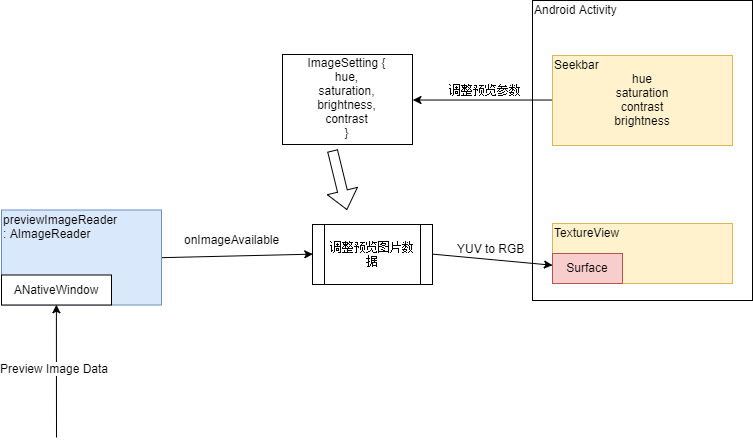

CameraView
=============

核心流程
--------------

环境要求
--------------
- Android Studio 2.3.0+ with [NDK-r16+](https://developer.android.com/ndk/) bundle
- Android device running android-26+

未解决问题
---------------
1. 竖屏时参数调整SeekBar方向没有同步调整

预览
---------------
安装app-debug.apk查看效果

